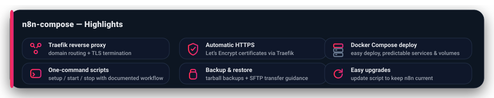

# n8n-compose

Self-host n8n on a Linux server using <b>Docker Compose</b> — a minimal, practical setup with a focus on reliability and easy upgrades.



---

## Prerequisites Checklist

- [ ] A Linux server (Ubuntu 24.04 recommended) — cloud VM  
       _Example: 2 vCPUs, 8 GB RAM, 30 GB SSD_  
       _(See [Hostinger’s n8n VPS requirements](https://www.hostinger.com/tutorials/n8n-vps-requirements) for minimum and recommended specs)_

- [ ] Firewall/security rules allowing ports **80** (HTTP) and **443** (HTTPS)  
       i.e. inbound TCP rules for 80 and 443 enabled

- [ ] A domain name with a DNS **A Record** pointing to your server’s public IP  
       Example: `n8n.example.com → <your-server-ip>`

- [ ] [Self-hosting knowledge prerequisites](docs/media/docs.n8n.io_hosting_installation_docker.png)

---

## Step-by-Step Installation

### 1. Connect to Your Instance

```bash
ssh -i your-key.pem ubuntu@<your-server-public-ip>
```

### 2. Clone the Repository

```bash
git clone https://github.com/riteshraj-shetage/n8n-compose.git
cd ~/n8n-compose
```

### 3. Run the Setup Script

```bash
bash scripts/setup-n8n.sh
```

> **Note:** The setup script adds your user to the `docker` group.  
> You must log out and back in (or run `newgrp docker`) before continuing,  
> otherwise you may see `permission denied` errors when running Docker commands.

### 4. Configure Your Environment

```bash
nano .env
```

**Update these values:**

```env
DOMAIN_NAME=example.com
SUBDOMAIN=n8n
SSL_EMAIL=your_email
GENERIC_TIMEZONE=UTC
```

### 5. Start n8n

```bash
bash scripts/start-n8n.sh
```

### 6. Access n8n

Open your browser and go to:

```
https://<SUBDOMAIN>.<DOMAIN_NAME>
```

### 7. First-Time Login

After starting n8n for the first time, you’ll be prompted to create the owner account by entering:  
**Email · First name · Last name · Password**

[Set up owner account screen](docs/media/set-up-owner-account-screen.png)

Once submitted, you’ll be redirected to the n8n dashboard.  
_(This setup step only appears once — it initializes your admin account for the instance.)_

---

For more details, see the official n8n Docker Compose guide:  
[https://docs.n8n.io/hosting/installation/server-setups/docker-compose/](https://docs.n8n.io/hosting/installation/server-setups/docker-compose/)
